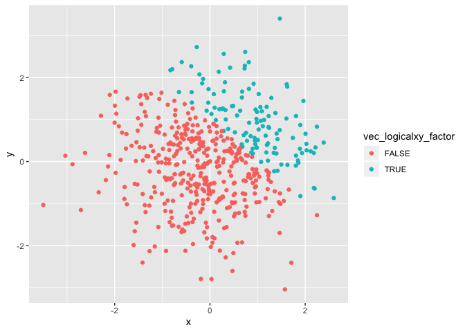

Homework 1
================
Nihan Gencerliler
9/20/2019

Setting up file and loading packages:

``` r
knitr::opts_chunk$set(echo = TRUE)
library(tidyverse)
library(ggplot2)
set.seed(5)
```

# Problem 1

Creating dataframe and taking the mean of each variable:

``` r
first_df = tibble(
vec_random_sample = rnorm(8),
vec_logical = vec_random_sample>0,
vec_character = c("A","B","C","D","E","F","G","H"),
vec_factor = factor(c("one", "two", "one", "two","three","one","two","three"))
)

mean(first_df[["vec_random_sample"]])
```

    ## [1] -0.08010625

``` r
mean(first_df[["vec_logical"]])
```

    ## [1] 0.375

``` r
mean(first_df[["vec_character"]])
```

    ## Warning in mean.default(first_df[["vec_character"]]): argument is not
    ## numeric or logical: returning NA

    ## [1] NA

``` r
mean(first_df[["vec_factor"]])
```

    ## Warning in mean.default(first_df[["vec_factor"]]): argument is not numeric
    ## or logical: returning NA

    ## [1] NA

When we try to take the means of the four variables, it only returns
values for vec\_random\_sample and vec\_logical because these are
numeric and logical variables respectively.

Code to convert vec\_logical, vec\_character, and vec\_factor to numeric
variables:

``` r
as.numeric(first_df[["vec_logical"]])
as.numeric(first_df[["vec_character"]])
as.numeric(first_df[["vec_factor"]])
```

The as.numeric function converts vec\_logical and vec\_factor to numeric
values but does not work for vec\_character. This explains what happened
when we tried to take the mean of vec\_logical as it treated this vector
as the numeric values that are returned by the as.numeric function.

Converting vec\_logical to different variable types and performing
operations:

``` r
(as.numeric(first_df[["vec_logical"]]))*(first_df[["vec_random_sample"]])
```

    ## [1] 0.00000000 1.38435934 0.00000000 0.07014277 1.71144087 0.00000000
    ## [7] 0.00000000 0.00000000

``` r
(as.factor(first_df[["vec_logical"]]))*(first_df[["vec_random_sample"]])
```

    ## Warning in Ops.factor((as.factor(first_df[["vec_logical"]])),
    ## (first_df[["vec_random_sample"]])): '*' not meaningful for factors

    ## [1] NA NA NA NA NA NA NA NA

``` r
(as.numeric(as.factor(first_df[["vec_logical"]])))*(first_df[["vec_random_sample"]])
```

    ## [1] -0.8408555  2.7687187 -1.2554919  0.1402855  3.4228817 -0.6029080
    ## [7] -0.4721664 -0.6353713

# Problem 2

Creating the second dataframe, second\_df:

``` r
second_df = tibble(
x = rnorm(500),
y = rnorm(500),
vec_logicalxy = x+y>1,
vec_logicalxy_numeric = as.numeric(vec_logicalxy),
vec_logicalxy_factor = as.factor(vec_logicalxy)
)

nrow(second_df)
```

    ## [1] 500

``` r
ncol(second_df)
```

    ## [1] 5

``` r
mean(second_df[["x"]]) 
```

    ## [1] 0.0007403497

``` r
median(second_df[["x"]]) 
```

    ## [1] -0.02997552

``` r
sd(second_df[["x"]]) 
```

    ## [1] 1.005462

``` r
table(second_df[["vec_logicalxy"]])
```

    ## 
    ## FALSE  TRUE 
    ##   382   118

``` r
prop.table(table(second_df[["vec_logicalxy"]]))
```

    ## 
    ## FALSE  TRUE 
    ## 0.764 0.236

``` r
#The dataset has 500 rows and 5 columns. X has a mean of 0.0007, median of
#-0.0299, and a standard deviation of 1.0055. The proportion of cases for which
#x + y > 1 is 23.6%, or 118 out of 500 cases.
```

## Scatterplot 1

Color points using logical variable and save it:

``` r
ggplot(second_df, aes(x=x,y=y)) + geom_point(aes(col=vec_logicalxy))
```

<!-- -->

``` r
ggsave("scatterplot1.pdf", height = 4, width = 6)
```

## Scatterplot 2

Color points using numeric
variable:

``` r
ggplot(second_df, aes(x=x,y=y)) + geom_point(aes(col=vec_logicalxy_numeric))
```

<!-- -->

## Scatterplot 3

Color points using factor
variable:

``` r
ggplot(second_df, aes(x=x,y=y)) + geom_point(aes(col=vec_logicalxy_factor))
```

<!-- -->

Logical and factor color scales are discrete while the numeric color
scale is a gradient.
